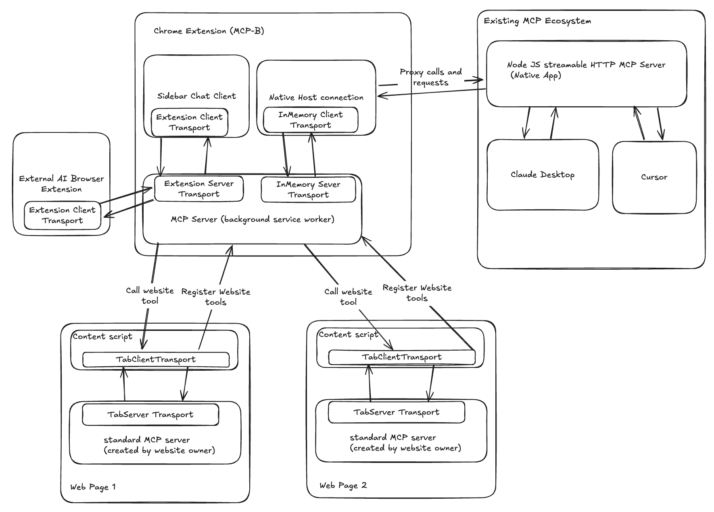
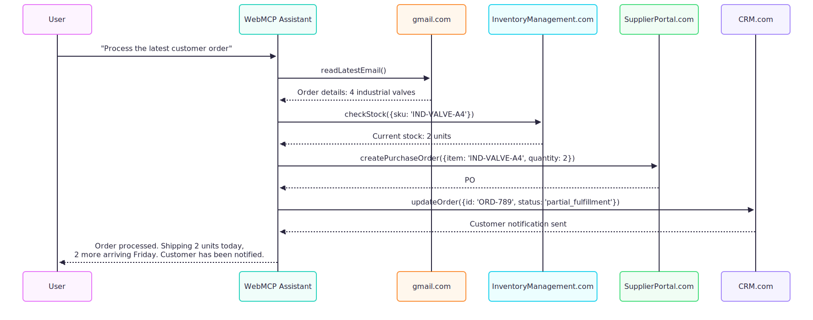

# MCP-B

Browser-based Model Context Protocol (MCP) implementation that enables AI assistants to interact with web applications through standardized MCP tools.

[](https://chromewebstore.google.com/detail/mcp-b/daohopfhkdelnpemnhlekblhnikhdhfa)
[](https://www.npmjs.com/package/@mcp-b/transports)
[](https://opensource.org/licenses/MIT)
[](https://github.com/MiguelsPizza/WebMCP/actions)
[](https://github.com/MiguelsPizza/WebMCP/stargazers)

[Quick Start](#quick-start) • [Demo](#demo) • [Installation](#installation) • [Documentation](https://mcp-b.ai) • [Contributing](#contributing)

## What is MCP-B?



MCP-B runs Model Context Protocol servers directly inside web pages, solving a critical gap where most white-collar work happens in browsers, yet MCP's standard solution bypasses browsers entirely. Instead of building complex OAuth flows or managing API keys, MCP-B leverages the browser's existing authentication and security model.

## The Problem

Current MCP implementations require developers to:

- Run servers locally with environment variables for API keys
- Implement complex OAuth 2.1 flows for remote servers
- Rebuild authentication layers that already exist in web applications
- Manage separate infrastructure for AI tool integration

For users, this means configuration files, API key management, and technical setup that creates insurmountable barriers for non-developers.

## The Solution

MCP-B embeds MCP servers directly into web applications, allowing AI assistants to:

- Use existing browser authentication (cookies, sessions, OAuth)
- Access structured data through MCP tools instead of screen scraping
- Orchestrate workflows across multiple web applications
- Maintain security within the browser's existing permission model

Unlike browser automation tools that rely on screenshots and DOM manipulation, MCP-B provides AI agents with precise, structured access to web application functionality through standardized JSON-RPC interfaces.

## Architecture Overview


_Traditional approach: MCP servers run locally, requiring API keys and configuration_


_MCP-B approach: Servers run in the browser, using existing authentication_

## Key Features

- **Zero-configuration authentication** - Uses existing browser sessions and cookies
- **Precise tool interfaces** - Structured JSON-RPC instead of DOM manipulation
- **Real-time synchronization** - Direct integration with web application state
- **Framework agnostic** - Works with any JavaScript framework or vanilla JS
- **Minimal implementation** - Typically requires less than 50 lines of code
- **Browser security model** - Respects same-origin policy and existing permissions

## Quick Start

Add MCP capabilities to your web application:

```bash
npm install @mcp-b/transports @modelcontextprotocol/sdk
```

```typescript
import { TabServerTransport } from '@mcp-b/transports';
import { McpServer } from '@modelcontextprotocol/sdk/server/mcp.js';
import { z } from 'zod';

const server = new McpServer({
  name: 'invoice-system',
  version: '1.0.0',
});

server.tool(
  'createInvoice',
  'Create a new invoice',
  {
    customerEmail: z.string().email(),
    items: z.array(
      z.object({
        description: z.string(),
        amount: z.number(),
      })
    ),
  },
  async ({ customerEmail, items }) => {
    // Use your existing authenticated API
    const response = await fetch('/api/invoices', {
      method: 'POST',
      headers: { 'Content-Type': 'application/json' },
      body: JSON.stringify({ customerEmail, items }),
    });

    return {
      content: [
        {
          type: 'text',
          text: JSON.stringify(await response.json()),
        },
      ],
    };
  }
);

const transport = new TabServerTransport();
await server.connect(transport);
```

## Demo

Try MCP-B with our live demo:

1. Install the [Chrome extension](https://chromewebstore.google.com/detail/mcp-b/daohopfhkdelnpemnhlekblhnikhdhfa)
2. Visit our [demo application](https://mcp-b.ai)
3. Open the extension and interact with the page through AI

## Other Examples

- [MCP-B with Vue Example](https://github.com/bestian/vue-MCP-B-demo) Thanks to [bestian](https://github.com/bestian)!

## Installation

### For Users

Install the Chrome extension from the [Chrome Web Store](https://chromewebstore.google.com/detail/mcp-b/daohopfhkdelnpemnhlekblhnikhdhfa). No API keys or configuration required - if you're logged into a website, the AI assistant can interact with it through your existing session.

### For Developers

```bash
# Core transport layer
npm install @mcp-b/transports

# React hooks (optional)
npm install @mcp-b/mcp-react-hooks

# Extension tools (optional)
npm install @mcp-b/extension-tools
```

### Native Messaging Host (Roadmap)

A native messaging host is planned to replace the WebSocket bridge, providing more reliable connectivity between browser extensions and desktop MCP clients like Claude Desktop and Cursor.

## Examples

### React Integration

```tsx
import { McpServerProvider, useMcpServer } from '@mcp-b/mcp-react-hooks';

function TodoApp() {
  const { registerTool } = useMcpServer();
  const [todos, setTodos] = useState([]);

  registerTool('addTodo', { text: z.string() }, async ({ text }) => {
    const newTodo = { id: Date.now(), text, done: false };
    setTodos((prev) => [...prev, newTodo]);
    return {
      content: [{ type: 'text', text: `Added: ${text}` }],
    };
  });

  return <div>{/* Your existing component */}</div>;
}
```

### Cross-Application Workflows



MCP-B enables AI assistants to orchestrate workflows across multiple web applications, each maintaining its own authentication and access controls. The AI operates with exactly the permissions of the logged-in user.

## Architecture

The system consists of three main components:

**Tab MCP Servers** run inside web pages, exposing tools that interact with authenticated APIs using the browser's credential management.

**The MCP-B Extension** acts as a bridge between tab servers and AI assistants, aggregating tools from all open tabs and routing requests appropriately.

**Transport Layers** handle secure communication between components using browser message passing APIs.

## Repository Structure

```
mcp-b/
├── packages/
│   ├── transports/          # Browser-specific MCP transports
│   ├── mcp-react-hooks/     # React integration
│   └── extension-tools/     # Chrome API tools
├── extension/               # Chrome extension
├── web/                     # Demo application and documentation
└── local-server/           # WebSocket bridge (deprecated)
```

## Development

```bash
# Clone and install
git clone https://github.com/MiguelsPizza/WebMCP.git
cd MCP-B
pnpm install

# Start development
pnpm dev                        # Start all packages
pnpm --filter extension dev     # Extension only
pnpm --filter web dev          # Web app only
```

The monorepo uses Turborepo for task orchestration and PNPM for package management. The extension auto-reloads on changes using WXT.

## Contributing

Contributions are welcome. Priority areas include:

- Firefox extension support
- MCP server implementations for popular web applications
- Documentation improvements
- UI/UX enhancements for the extension

See [CONTRIBUTING.md](./CONTRIBUTING.md) for guidelines.

## Security Considerations

MCP-B operates entirely within the browser's security sandbox:

- Extensions only access tabs the user has open
- Web pages cannot directly access extension APIs
- All communication respects the browser's same-origin policy
- Tool execution happens in page context with user permissions

## Roadmap

- [x] Chrome extension
- [x] NPM packages
- [ ] Firefox extension
- [ ] Native messaging host (replacing WebSocket bridge)
- [ ] Safari extension
- [ ] Enhanced developer tools

## License

MIT License - see [LICENSE](./LICENSE) for details.

## Credits

Created by [@miguelspizza](https://github.com/miguelspizza). Special thanks to Anthropic for creating MCP.

---

[Website](https://mcp-b.ai) • [GitHub](https://github.com/MiguelsPizza/WebMCP) • [Email](mailto:alexmnahas@gmail.com)
